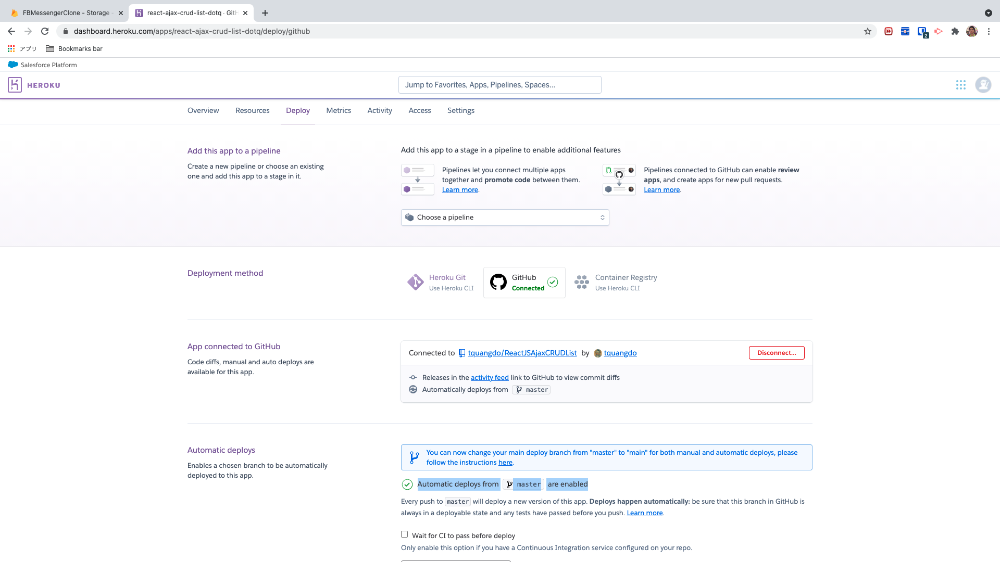

# react-ajax-demo-crud-list 🚀

[](https://github.com/tquangdo/react-ajax-demo-crud-list/issues/new)
***********


## deploy local
1. `node index.js`
2. access "localhost:3001"

## heroku

Dùng GIT "trangia@gmail.com" connect acc Heroku `tquangdo1103` (acc thứ 2 ngoài acc 1 `trangia61`)
1. `~/.ssh$ ssh-keygen -t rsa`
- đặt tên để tạo ra 2 file "id_rsa_heroku_tquangdo1103" & "id_rsa_heroku_tquangdo1103.pub"
2. `heroku keys:ad`
chọn "id_rsa_heroku_tquangdo1103"
3. check: `heroku keys`
-> hiện "id_rsa_heroku_tquangdo1103"
4. https://github.com/settings/keys
click "New SSH key" > add "id_rsa_heroku_tquangdo1103.pub"
5. tạo file "~.ssh/config"
```bash
Host heroku.work (chú ý phải là "heroku.work")
  HostName heroku.com (chú ý phải là "heroku.com")
  IdentityFile ~/.ssh/id_rsa_heroku_tquangdo1103
  IdentitiesOnly yes
```
6. edit file "~/.git/config"
```shell
[remote "heroku"]
   	url = git@heroku.work:react-ajax-crud-list-dotq.git (chú ý phải là "heroku.work")
```
