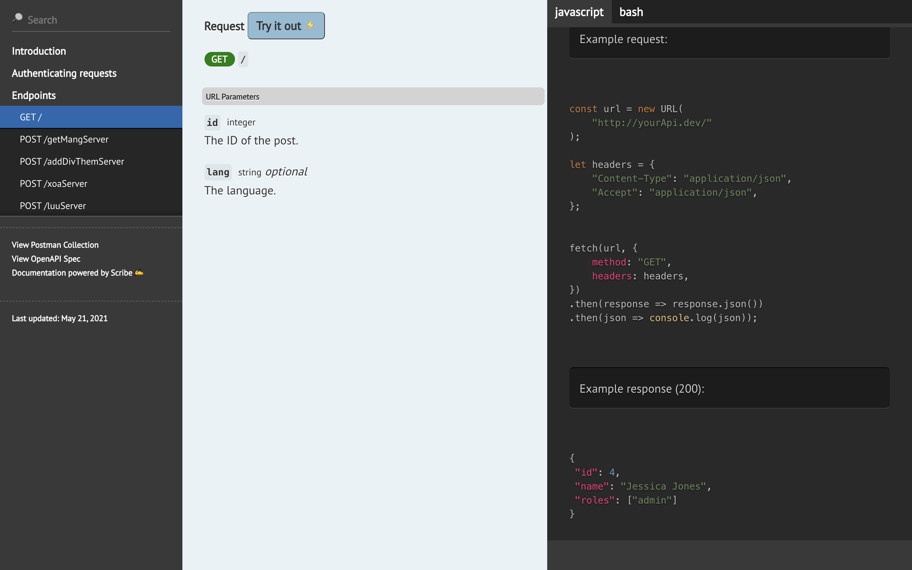
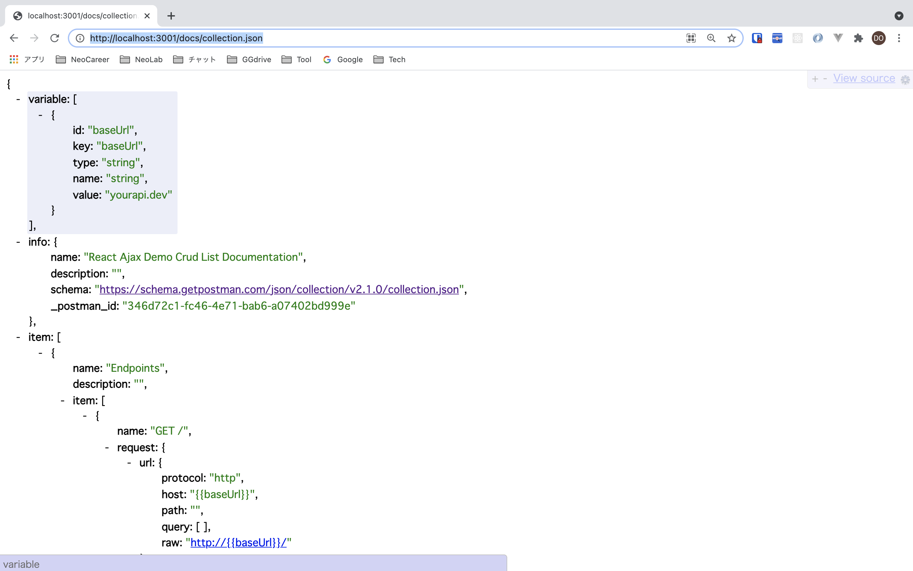
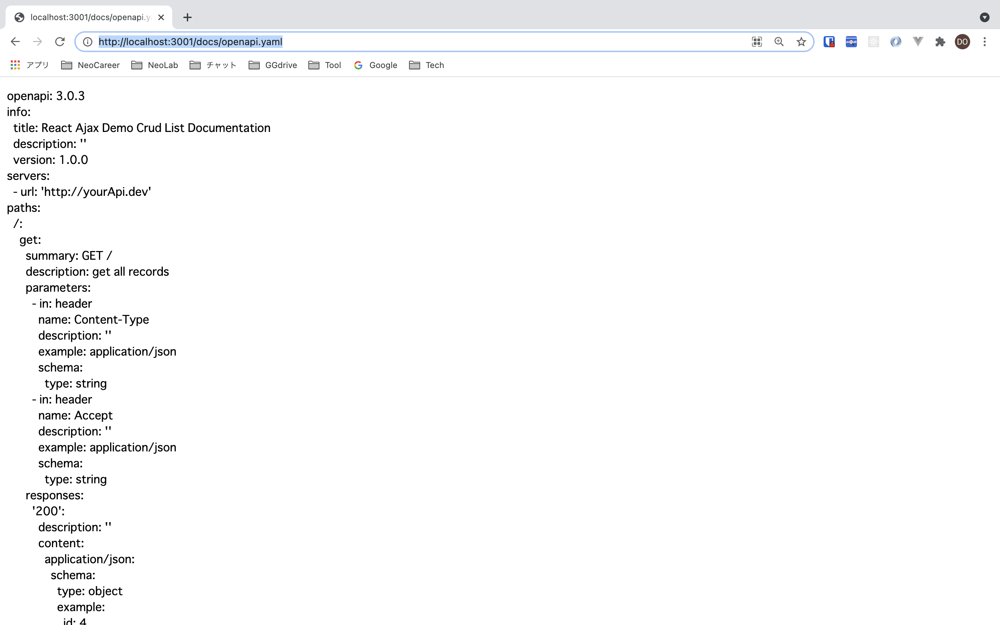

# react-ajax-demo-crud-list 🚀

[](https://github.com/tquangdo/react-ajax-demo-crud-list/issues/new)
***********


## deploy local
1. `node index.js`
2. access "localhost:3001"

## heroku

### install
- `npm i -g heroku`
### dashboard on website

***********
### setting
#### create 2nd heroku's acc (JUST FOR WIN OS!!!)
Dùng GIT "trangia61@" connect acc Heroku `tquangdo1103` (acc thứ 2 ngoài acc 1 `trangia61`)
1. đặt tên "id_rsa_heroku_tquangdo1103" để tạo ra 2 file "id_rsa_heroku_tquangdo1103" & "id_rsa_heroku_tquangdo1103.pub"
```bash
(05/15/21)NC00011462@dotq ~/.ssh% ssh-keygen -t rsa         
Generating public/private rsa key pair.
Enter file in which to save the key (/Users/NC00011462/.ssh/id_rsa): id_rsa_heroku_tquangdo1103
Enter passphrase (empty for no passphrase): 
Enter same passphrase again: 
Your identification has been saved in id_rsa_heroku_tquangdo1103.
Your public key has been saved in id_rsa_heroku_tquangdo1103.pub.
The key fingerprint is:
SHA256:eRoNC8PHsVioSY7qnDItF/15VSSVvHfz3YX0mfozysc NC00011462@N20LT956.local
The key's randomart image is:
+---[RSA 3072]----+
|       .o  o..   |
|    ...+ o. + .  |
|   + o= =  o o oo|
|  . +  + =  o o++|
| . .    S o. ...*|
|. . .    +.  .  +|
|o... . ...    o  |
|++o   o .   .  E |
|.+     .     oo o|
+----[SHA256]-----+
(05/15/21)NC00011462@dotq ~/.ssh% ls -la
total 96
drwx------  12 NC00011462  staff   384  5 15 01:26 .
drwxr-xr-x+ 42 NC00011462  staff  1344  5 15 01:18 ..
-rw-r--r--@  1 NC00011462  staff  6148  4  8 19:16 .DS_Store
-rw-r--r--   1 NC00011462  staff  4556  4  8 19:14 config
-rw-------   1 NC00011462  staff  2610  5 15 01:26 id_rsa
-rw-r--r--   1 NC00011462  staff   579  5 15 01:26 id_rsa.pub
-rw-------   1 NC00011462  staff  2610  5 15 01:25 id_rsa_heroku_tquangdo1103
-rw-r--r--   1 NC00011462  staff   579  5 15 01:25 id_rsa_heroku_tquangdo1103.pub
-r--------@  1 NC00011462  staff  3243  3  8 13:33 jinjer_integration_dev.pem
-r--------@  1 NC00011462  staff  3247  3  8 13:18 jinjer_integration_prod.pem
-r--------@  1 NC00011462  staff  3243  3  8 13:33 jinjer_integration_stg.pem
-rw-r--r--   1 NC00011462  staff  3243  4 21 23:41 known_hosts
```
2. chọn "id_rsa_heroku_tquangdo1103"
```shell
(05/15/21)NC00011462@dotq ~/Documents/GitHub/react-ajax-demo-crud-list% heroku keys:add
? Which SSH key would you like to upload? 
  /Users/NC00011462/.ssh/id_rsa.pub 
❯ /Users/NC00011462/.ssh/id_rsa_heroku_tquangdo1103.pub
```
3. check: 
```bash
(05/15/21)NC00011462@dotq ~/Documents/GitHub/react-ajax-demo-crud-list% heroku keys
=== tquangdo1103@gmail.com keys
ssh-rsa AAAAB3NzaC...D69zaYyxk= NC00011462@N20LT956.local
ssh-rsa AAAAB3NzaC...gjMiUGO0yl DoTQ@DESKTOP-CCFC4M2
```
4. https://github.com/settings/keys
- click "New SSH key" > add "id_rsa_heroku_tquangdo1103.pub"

***********
5. edit file "~.ssh/config"
```bash
(05/15/21)NC00011462@dotq ~/.ssh% less config 
#~~~~~~~~~~~~~~~~~Heroku
Host heroku.work (chú ý phải là "heroku.work")
  HostName heroku.com (chú ý phải là "heroku.com")
  IdentityFile ~/.ssh/id_rsa_heroku_tquangdo1103
  IdentitiesOnly yes

#~~~~~~~~~~~~~~~~~Signing dev
Host ...
```
***********
6. edit file "config" of project
```bash
(05/15/21)NC00011462@dotq ~/Documents/GitHub/react-ajax-demo-crud-list% less .git/config
[core]
	repositoryformatversion = 0
	...
[remote "origin"]
	...
[remote "heroku"]
   	url = git@heroku.work:react-ajax-crud-list-dotq.git (chú ý phải là "heroku.work")
[branch "master"]
	remote = origin
	merge = refs/heads/master
```
***********
#### commands
https://github.com/tquangdo/node-zoom-clone-app/blob/master/memo.txt
- check buildpacks: `heroku buildpacks -a react-ajax-crud-list-dotq`
- -> `heroku/nodejs`


## scribe doc generator (https://scribe-js.readthedocs.io/)

### install
1. `npm i @knuckleswtf/scribe-express`
2. `npx scribe init`
- in auto generated questions, choose same port with index.js: `3001` -> auto create `.scribe.config.js`

### setting
1. edit in `.scribe.config.js`:
```js
openapi: {
        enabled: true, // false->true
...
```
2. edit in `index.js`:
```js
require('@knuckleswtf/scribe-express')(app)
...
module.exports = app
```

### generate
- `npx scribe generate -a index.js`
>need stop all processes running `3001`
- -> auto create API accroding to `index.js`:
```js
app.get("/", function (req, res) {...}
app.post("/getMangServer", function (req, res) {...}
app.post("/addDivThemServer", parser, function (req, res) {...}
app.post("/xoaServer", parser, function (req, res) {...}
app.post("/luuServer", parser, function (req, res) {...}
```
- `nodemon index`

### result
1. access browser "http://localhost:3001/docs"


2. click `View Postman Collection`


3. click `View OpenAPI Spec`



